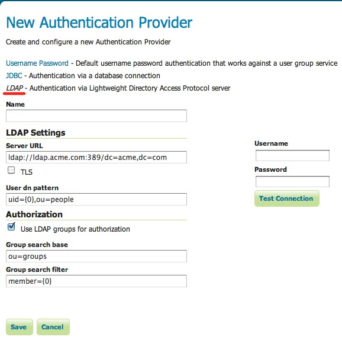
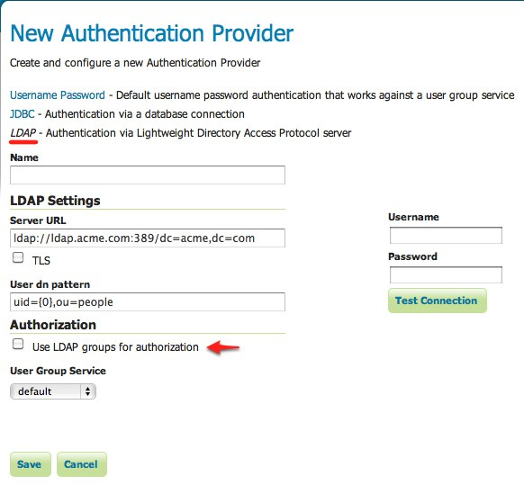

.. _sec_auth_provider_ldap:

LDAP Authentication
===================

The LDAP Authentication provider allows for authentication against a `Lightweight Directory Access Protocol <http://en.wikipedia.org/wiki/Lightweight_Directory_Access_Protocol>`_ (LDAP) server.  The provider takes the username/password from the incoming request and attempts to connect to the LDAP server with those credentials. 

.. note:: Currently only LDAP Bind authentication is supported.

Role assignment
---------------

The LDAP provider offers two options for role assignment for authenticated users:

* Convert the user's LDAP groups into roles
* Employ a user/group service

As an example of the first option, consider the following LDAP database::

    dn: ou=people,dc=acme,dc=com
    objectclass: organizationalUnit
    ou: people
    
    dn: uid=bob,ou=people,dc=acme,dc=com
    objectclass: person
    uid: bob
    
    dn: ou=groups,dc=acme,dc=com
    objectclass: organizationalUnit
    ou: groups
    
    dn: cn=workers,ou=groups,dc=acme,dc=com
    objectclass: groupOfNames
    cn: users
    member: uid=bob,ou=people,dc=acme,dc=com

The above scenario defines a user with the ``uid`` of ``bob``, and a ``group`` named ``workers`` of which ``bob`` is a member. After authentication, ``bob`` will be assigned the role ``ROLE_WORKERS``. The role name is built by concatenating ``ROLE_`` with the name of the group in upper case.

In the case of using a :ref:`user/group service <sec_rolesystem_usergroupservices>`, the user/group service is queried for the user following authentication, and the role assignment is performed by the user/group service and the active :ref:`role service <sec_rolesystem_roleservices>`.  When using this option, any password defined for the user in the user/group service database is ignored.

Installation
------------

.. warning:: TODO

Configuration
-------------

The following shows the configuration options for the JDBC authentication provider.

   *Configuring the LDAP authentication provider using LDAP groups for role assignment*

   *Configuring the LDAP authentication provider using user/group service for role assignment*

.. list-table::
   :widths: 30 10 60
   :header-rows: 1

   * - Option
     - Required?
     - Description
   * - Name
     - Yes
     - Name of the LDAP connection in GeoServer
   * - Server URL
     - Yes
     - URL for the LDAP server connection. It must include the protocol, host, and port, as well as the "distinguished name" (DN) for the root of the LDAP tree.
   * - TLS
     - N/A
     - Enables a STARTTLS connection. (See the section on :ref:`sec_auth_provider_ldap_secure`.)
   * - User DN pattern
     - Yes
     - Search pattern to use to match the DN of the user in the LDAP database. The pattern should contain the placeholder ``{0}`` which is injected with the ``uid`` of the user. In the above example the pattern would be ``uid={0},ou=people``.  The root DN specified as port of the *Server URL* is automatically appended.
   * - Use LDAP groups for authorization
     - N/A
     - Specifies whether to use LDAP groups for role assignment. 
   * - Group search base
     - Yes
     - Relative name of the node in the tree to use as the base for LDAP groups. In the above example, this would be ``ou=groups``.  The root DN specified as port of the *Server URL* is automatically appended.  *Only applicable when the Use LDAP groups for authorization parameter is checked.*
   * - Group search filter
     - Yes
     - Search pattern to use in order to locate the user's LDAP groups that the user is part of. The pattern may contain two placeholder values:
       * ``{0}``, is the full DN of the user (``uid=bob,ou=people,dc=acme,dc=com``) in the above example.
       * ``{1}``, is the ``uid`` portion of the full DN, which would be ``bob`` in the example. 
       In the example the pattern would be ``member={0}``.  *Only applicable when the Use LDAP groups for authorization parameter is checked.*
   * - User Group Service
     - N/A
     - The user/group service to use for role assignment.  *Only applicable when the Use LDAP groups for authorization parameter is not checked.*

.. _sec_auth_provider_ldap_secure:

Secure LDAP connections
-----------------------

There are two ways to create a secure LDAP connection with the server. The first is to directly specify a secure connection
by using the **ldaps** protocol as part of the *Server URL*. This typically requires changing the connection port to **port 636** rather than 389.

The second method involves using **STARTTLS** (Transport Layer Security) to negotiate a secure connection over a non-secure one. The negotiation takes place over the non-secure URL using the "ldap" protocol on port 389. To use this option, the *Use TLS* flag must be set.

.. warning::  Using TLS for connections will prevent GeoServer from being able to pool LDAP connections.  This means a new LDAP connection will be created and destroyed for each authentication, resulting in loss of performance.