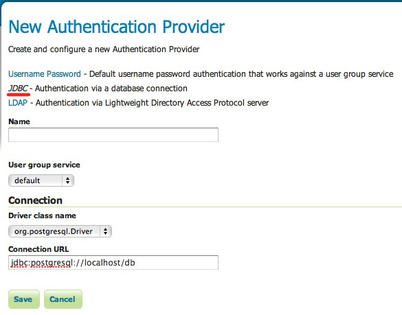

.. _sec_auth_provider_jdbc:

JDBC Authentication
===================

The JDBC authentication provider authenticates by connecting to a database over `JDBC <http://en.wikipedia.org/wiki/Java_Database_Connectivity>`_.

The provider takes the username and password from the incoming request and attempts to create a database connection using those credentials. Optionally the provider may use a :ref:`user/group service <sec_rolesystem_usergroupservices>` to load user information after a successful authentication. In this context the user/group service will not be used for password verification, only for role assignment.

.. note:: To use the user/group service for password verification, please see the section on :ref:`sec_auth_provider_userpasswd`.

Configuration
-------------

The following shows the configuration options for the JDBC authentication provider.

   *Configuring the JDBC authentication provider*

.. list-table::
   :widths: 30 10 60
   :header-rows: 1

   * - Option
     - Required?
     - Description
   * - Name
     - Yes
     - Name of the JDBC connection in GeoServer
   * - User Group Service
     - Yes
     - Name of the user/group service to use to load user information after the user is authenticated
   * - Driver class name
     - Yes
     - JDBC driver to use for the database connection
   * - Connection URL
     - Yes
     - JDBC URL to use when creating the database connection