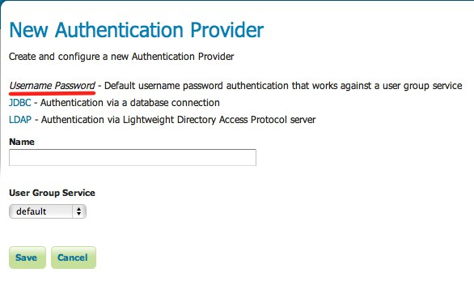

.. _sec_auth_provider_userpasswd:

Username/password authentication
================================

Username and password authentication is the default authentication provider.  It uses a :ref:`user/group service <sec_rolesystem_usergroupservices>` to authenticate.

The provider simply takes the username and password from an incoming request (such as a Basic Authentication request), and then loads the user information from the user/group service and verifies the credentials.

Configuration
-------------

The following shows the configuration options for the username/password provider.

   *Configuring the username/password authentication provider*

.. list-table::
   :widths: 30 10 60
   :header-rows: 1

   * - Option
     - Required?
     - Description
   * - Name
     - Yes
     - Name of the connection in GeoServer
   * - User Group Service
     - Yes
     - Name of the user/group service

