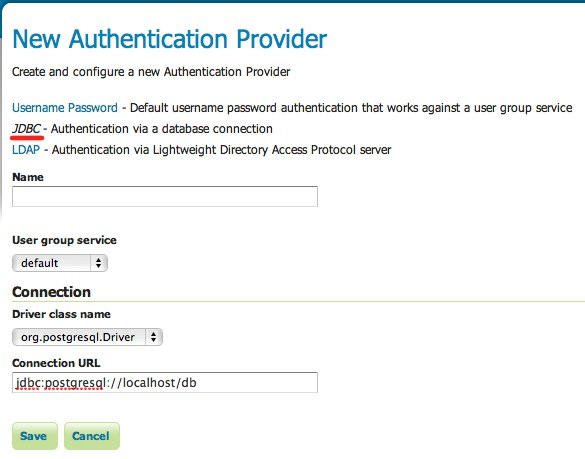

.. _auth_jdbc:

JDBC
====

Authenticates by connecting to a database over JDBC.

The provider takes the username/password from the incoming request, and attempts to create a database connection with those
credentials. Optionally the provider may use a user/group service to load user information after a successful 
authentication. In this context the user/group service will not be used for password verification, only for role
assignment.

Installation
------------

TODO

Configuration
-------------

*User Group Service* is the optional user/group service to use to load user information after the user is 
successfully authenticated.

*Driver class name* is the JDBC driver to use for the database connection.

*Connection URL* specifies the JDBC url to use when creating the database connection.