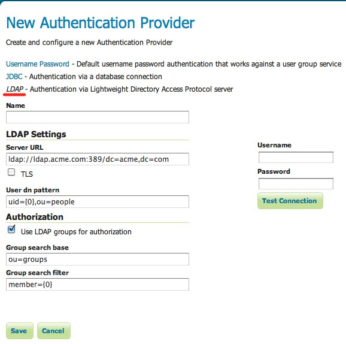
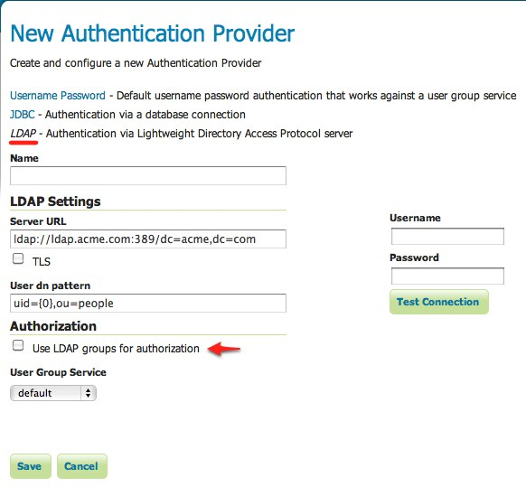

.. _auth_ldap:

LDAP
====

Authenticates against a `Lightweight Directory Access Protocol <http://en.wikipedia.org/wiki/Lightweight_Directory_Access_Protocol>`_ (LDAP) server.

The provider takes the username/password from the incoming request and attempts to connect to the LDAP server with those
credentials. 

.. note::

   Currently only LDAP Bind authentication is supported.
   
The ldap provider offers two option when it comes to role assignment for authenticated users. The first is to use the LDAP 
groups the user is part of and turn them into roles. As an example consider the following LDAP database::

    dn: ou=people,dc=acme,dc=com
    objectclass: organizationalUnit
    ou: people
    
    dn: uid=bob,ou=people,dc=acme,dc=com
    objectclass: person
    uid: bob
    
    dn: ou=groups,dc=acme,dc=com
    objectclass: organizationalUnit
    ou: groups
    
    dn: cn=workers,ou=groups,dc=acme,dc=com
    objectclass: groupOfNames
    cn: users
    member: uid=bob,ou=people,dc=acme,dc=com
    

The above defines a user with the id "bob", and a group named "workers" which bob is a member of. After authentication bob 
will be assigned the role "ROLE_WORKERS". The role name is the name of the group, uppercase and prefixed with "_ROLE".

The second option for role assignment is to use a user/group service. After authentication the user/group is queried for
the user, at which time role assignment is performed by the user/group service and the active role service. When using this
option any password defined for the user in the user/group service database is ignored.

Installation
------------

TODO

Configuration
-------------

*Server URL* is the url to use for the ldap server connection. It includes the protocol, host and port, as well as the "distinguished name" (DN) for the root of the ldap tree. 

*TLS* is a flag which enables a "StartTLS" connection. More on this :ref:`below <ldap_secure>`. 

*User DN pattern* is the search pattern to use to match the DN of the user in the ldap database. The pattern should contain 
the placeholder ``{0}`` which is injected with the uid of the user. In the above examples this would be the value "bob"
and the pattern would be "uid={0},ou=people". Note that the root DN specified as part of the *Server URL* is appended 
automatically resulting in the query "uid={0},ou=people,dc=acme,dc=com" in the example.

*Use LDAP groups for authorization* specifies whether to map ldap groups for role assignment. 

*Group search base* is the relative name of the node in the tree to use as the base for ldap groups. In "ou=groups" in the
above example. The root DN specified as port of the *Server URL* is automatically appended.

*Group search filter* is the search pattern to use in order to locate ldap groups that the user is part of. The pattern may 
contain two placeholder values. The first, ``{0}``, is the full DN of the user, which would be 
"uid=bob,ou=people,dc=acme,dc=com" in the above example. The second placeholder ``{1}``, is the uid portion of the full DN,
which would be "bob" in the example. In the example the pattern would be "member={0}".

The following parameters apply only when the *Use LDAP groups for authorization* flag is unset. 

*User Group Service* is the user/group service to use for role assignment. 

.. _ldap_secure:

Secure LDAP connections
^^^^^^^^^^^^^^^^^^^^^^^

There are two ways to create a secure LDAP connection with the server. The first is to directly specify a secure connection
by using the "ldaps" protocol as part of the *Server URL*. This usually requires changing the connection port to 636 rather than 389.

The second method involves using "StartTLS" (Transport Layer Security) to negotiate a secure connection over a non-secure one. The negotiation takes place over the "regular" url with a protocol of "ldap" and port 389. To use this option the *Use TLS* flag must be set.

.. warning::

   Using TLS for connections means that internally GeoServer will not be able to pool ldap connections, which means a new
   LDAP connection will be created and destroyed for each authentication, resulting in loss of performance. 