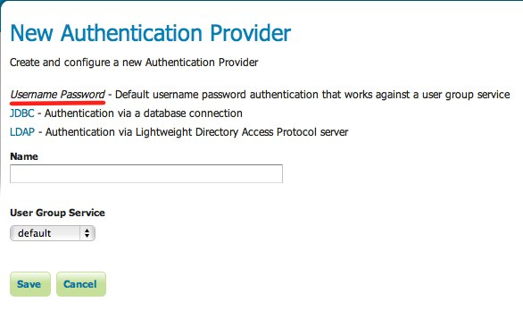

.. _auth_userpasswd:

Username/password
=================

Default authentication provider that uses a user/group service to authenticate. 

The provider simply takes 
username/password from the incoming request, loads the user information from the user/group service, and verifies the user
password.

Configuration
-------------

*User Group Service* is the user/group service to use.

