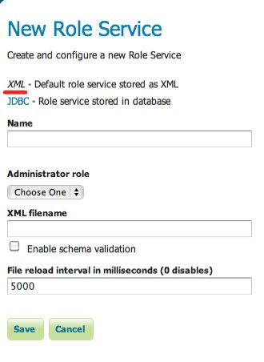

.. _role_xml:

XML
===

Default role service that persists the role database in an XML file.

The xml role service represents the role database as XML corresponding to this :download:`XML schema`. The file is 
named ``roles.xml`` and is located under the ``security`` directory at a path of ``role/<name>/roles.xml`` where
``<name>`` is the name of the role service.

The following is the contents of ``role.xml`` that ships with an out of the box GeoServer configuration:

.. code-block:: xml

      <roleRegistry version="1.0" xmlns="http://www.geoserver.org/security/roles">
          <roleList>
              <role id="ROLE_ADMINISTRATOR"/>
          </roleList>
          <userList>
              <userRoles username="admin">
                  <roleRef roleID="ROLE_ADMINISTRATOR"/>
              </userRoles>
          </userList>
          <groupList/>
      </roleRegistry>
      
  
It contains a single role named "ROLE_ADMINISTRATOR" and assigns the role to the "admin" user.

Configuration
-------------

*Administrator role* is the role defined by this role service that should be considered the administrative role. In the 
default role service this role is "ROLE_ADMINISTRATOR". 

*XML Filename* is the name of the file used to persist the XML role database. If left unspecified the default 
filename ``roles.xml`` is used.

*Enable schema validation* forces schema validation to occur every time the role xml file is read. This
option is useful when editing the file by hand.

*File reload interval* defines the time interval in which GeoServer will check for changes to the role XML file. When
the file is found to be modified the file will be re-read, and the role database recreated. This value is meant to be
set in cases where the XML file contents might change "out of process", and not directly through the web admin interface. 
The value is specified in milliseconds, for example a value of 5000 would cause a check to be made very 5 seconds. A value
of 0 disables any checking of the file.
