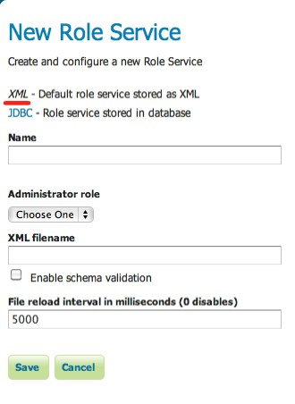

.. _sec_rolesystem_roleservices:

Role services
=============

A **role service** is a source of information for roles. It provides the following:

* List of roles
* Calculation of role assignments for a given user

When a user/group service loads information about a user or a group, it delegates to the role service to determine which 
roles should be assigned to the user or group.  Unlike :ref:`sec_rolesystem_usergroupservices`, there is only a single role service active at any given time.

GeoServer comes with out of the box support for a single type of role service that persists role information as XML. 
Additional role service implementations are available as extensions.

The following role services are available in GeoServer:

* :ref:`XML <sec_rolesystem_rolexml>` - Default role service persisted as XML
* :ref:`JDBC <sec_rolesystem_rolejdbc>`  - Role service persisted in database via JDBC

.. _sec_rolesystem_rolexml:

XML role service
----------------

The XML role service persists the role database in an XML file.  This is the default role service in GeoServer.

This service represents the user database as XML corresponding to this :download:`XML schema`. The file is 
named :file:`roles.xml` and is located inside the GeoServer data directory at a path of ``security/role/<name>/roles.xml``, where
``<name>`` is the name of the role service.

.. warning:: NOTHING TO DOWNLOAD ABOVE!

The following is the contents of ``roles.xml`` that ships with the default GeoServer configuration:

.. code-block:: xml

   <roleRegistry version="1.0" xmlns="http://www.geoserver.org/security/roles">
     <roleList>
       <role id="ROLE_ADMINISTRATOR"/>
     </roleList>
     <userList>
       <userRoles username="admin">
         <roleRef roleID="ROLE_ADMINISTRATOR"/>
       </userRoles>
     </userList>
     <groupList/>
   </roleRegistry>

This configuration contains a single role named ``ROLE_ADMINISTRATOR`` and assigns the role to the ``admin`` user.

Configuration
~~~~~~~~~~~~~

The following figure shows the configuration options for the XML role service.

   *Configuring the XML role service*

.. list-table::
   :widths: 30 10 60
   :header-rows: 1

   * - Option
     - Required?
     - Description
   * - Name
     - Yes
     - Name of the XML role service in GeoServer
   * - Administrator role
     - Yes
     - The administrative role as defined by this role service. In the default role service this role is ``ROLE_ADMINISTRATOR``. 
   * - XML Filename
     - No
     - The name of the file used to persist the XML role database. If left unspecified, the default filename :file:`roles.xml` is used.
   * - Enable schema validation
     - Yes
     - If checked, forces schema validation to occur every time the XML file is read. This option is useful when editing the XML file by hand.
   * - File reload interval
     - No
     - Defines the frequency in which GeoServer will check for changes to the XML file. If the file is found to have been modified, GeoServer will recreate the user/group database based on the current state of the file. This value is meant to be set in cases where the XML file contents might change "out of process" and not directly through the web admin interface.  The value is specified in milliseconds, while a value of 0  disables any checking of the file.

.. _sec_rolesystem_rolejdbc:

JDBC role service
-----------------

The JDBC role service persists the role database via JDBC.  It represents the role database with multiple tables.  The following shows the database schema:

.. list-table:: Table: users
   :widths: 15 15 15 15 
   :header-rows: 1

   * - Field
     - Type
     - Null
     - Key
   * - name
     - varchar(64)
     - NO
     - PRI
   * - parent
     - varchar(64)
     - YES
     - 

.. list-table:: Table: role_props
   :widths: 15 15 15 15 
   :header-rows: 1

   * - Field
     - Type
     - Null
     - Key
   * - rolename
     - varchar(64)
     - NO
     - PRI
   * - propname
     - varchar(64)
     - NO
     - PRI
   * - propvalue
     - varchar(2048)
     - YES
     - 

.. list-table:: Table: user_roles
   :widths: 15 15 15 15 
   :header-rows: 1

   * - Field
     - Type
     - Null
     - Key
   * - username
     - varchar(128)
     - NO
     - PRI
   * - rolename
     - varchar(64)
     - NO
     - PRI

.. list-table:: Table: group_roles
   :widths: 15 15 15 15 
   :header-rows: 1

   * - Field
     - Type
     - Null
     - Key
   * - groupname
     - varchar(128)
     - NO
     - PRI
   * - rolename
     - varchar(64) 
     - NO
     - PRI

The ``roles`` table is the primary table and contains the list of roles.  Roles in GeoServer support inheritance, so a role may optionally have a link to a parent role. The ``role_props`` table is a mapping table that maps additional properties to a role. (See the section on :ref:`sec_rolesystem_roles` for more details.)  The ``user_roles`` table maps users to the roles they are assigned.  Similarly the ``group_roles`` table does the same but for groups rather than users. 

The default GeoServer security configuration would be represented with the following database contents::

    > select * from roles;
    +--------------------+--------+
    | name               | parent |
    +--------------------+--------+
    | ROLE_ADMINISTRATOR | NULL   |
    +--------------------+--------+

    > select * from role_props;
    Empty

    > select * from user_roles;
    +----------+--------------------+
    | username | rolename           |
    +----------+--------------------+
    | admin    | ROLE_ADMINISTRATOR |
    +----------+--------------------+

    > select * from group_roles;
    Empty

Installation
~~~~~~~~~~~~

.. warning:: INSTALLATION?
    
Configuration
~~~~~~~~~~~~~

The following figure shows the configuration options for the JDBC role service.

   *Configuring the JDBC role service*

.. list-table::
   :widths: 30 10 60
   :header-rows: 1

   * - Option
     - Required?
     - Description
   * - Name
     - Yes
     - Name of the JDBC role service in GeoServer
   * - Administrator role
     - Yes
     - The name of the role that performs the administrator function
   * - JNDI
     - Yes
     - When unchecked, specifies a direct connection to the database. When checked, specifies an existing connection located through JNDI. See the section on :ref:`sec_rolesystem_usergroupjdbc_jndi` in the section on JDBC user/group services for more information.
   * - Driver class name
     - Yes
     - JDBC driver to use for the database connection
   * - Connection URL
     - Yes
     - Specifies the JDBC URL to use when creating the database connection
   * - Username
     - Yes
     - Username to use when connecting to the database
   * - Password
     - Yes
     - Password to use when connecting to the database
   * - Create database tables
     - Yes
     - Specifies whether to create all the necessary tables in the underlying database
   * - Data Definition Language (DDL) file
     - No
     - Specifies a custom DDL file to use for creating tables in the underlying database, for cases where the default DDL statements fail on the given database.  If left blank, internal defaults are used.
   * - Data Manipulation Language (DML) file
     - No
     - Specifies a custom DML file to use for accessing tables in the underlying database, for cases where the default DML statements fail on the given database. If left blank, internal defaults are used.

