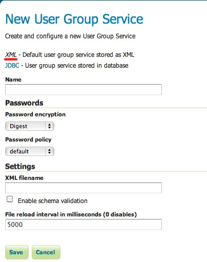
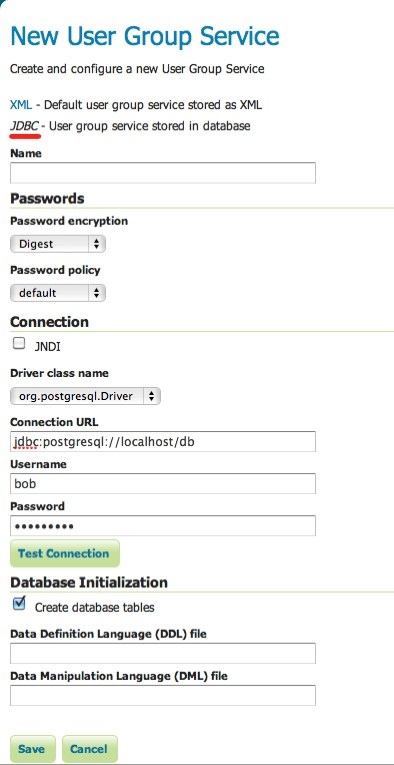
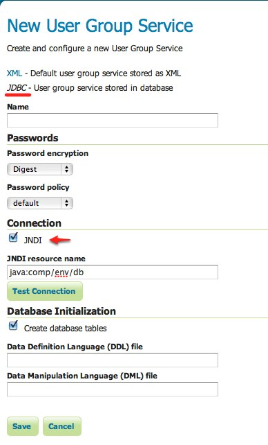

.. _sec_rolesystem_usergroupservices:

User/group services
===================

A **user/group service** is a source of information for users and groups. It provides the following:

* Listing of users
* Listing of groups, including users affiliated with each group
* User passwords

Many types of authentication providers will make use of a user/group service to perform authentication. The user/group service is the database for looking up users and performing password authentication.  Depending on how the :ref:`sec_auth_chain` is configured there can be any number (including zero) user/group services active at any given time.

A user/group service can be read-only, in that it only provides a source of user information and does not allow for the adding/changing of new users and groups. Such a case would occur if a user/group service was set up to delegate to some external service for the database of users and groups. An example of this would be an external LDAP server.

GeoServer comes by default with support for a single type of user/group service that persists this information in XML. Additional user/group service implementations are available as extensions.

.. warning:: HOW TO GET EXTENSION?  ARE THERE MORE THAN XML/JDBC?

The following user group services are available in GeoServer:

* :ref:`XML <sec_rolesystem_usergroupxml>` - Default user/group service persisted as XML
* :ref:`JDBC <sec_rolesystem_usergroupjdbc>` - User/group service persisted in database via JDBC

.. _sec_rolesystem_usergroupxml:

XML user/group service
----------------------

The XML user/group service persists the user/group database in an XML file.  This is the default behavior in GeoServer.

This service represents the user database as XML corresponding to this :download:`XML schema`. The file is 
named :file:`users.xml` and is located inside the GeoServer data directory at a path of ``security/usergroup/<name>/users.xml``, where
``<name>`` is the name of the user/group service.

.. warning:: NOTHING TO DOWNLOAD ABOVE!

The following is the contents of ``users.xml`` that ships with the default GeoServer configuration:

.. code-block:: xml

   <userRegistry version="1.0" xmlns="http://www.geoserver.org/security/users">
     <users>
       <user enabled="true" name="admin" password="crypt1:5WK8hBrtrte9wtImg5i5fjnd8VeqCjDB"/>
     </users>
     <groups/>
   </userRegistry>
  
This configuration contains a single user named ``admin`` and no groups. User passwords are stored encrypted by default using the 
:ref:`weak PBE <sec_passwd_encryption>` method.

Configuration
~~~~~~~~~~~~~

The following figure shows the configuration options for the XML user/group service.

   *Configuring the XML user/group service*

.. list-table::
   :widths: 30 10 60
   :header-rows: 1

   * - Option
     - Required?
     - Description
   * - Name
     - Yes
     - Name of the XML user/group service in GeoServer
   * - Password encryption
     - Yes
     - The method to used to :ref:`encrypt user passwords <sec_passwd_encryption>`
   * - Password policy
     - Yes
     - The :ref:`policy <sec_passwd_policy>` to use to enforce constraints on user passwords. 
   * - XML Filename
     - No
     - The name of the file used to persist the XML user/group database. If left unspecified, the default filename :file:`users.xml` is used.
   * - Enable schema validation
     - Yes
     - If checked, forces schema validation to occur every time the XML file is read. This option is useful when editing the XML file by hand.
   * - File reload interval
     - No
     - Defines the frequency in which GeoServer will check for changes to the XML file. If the file is found to have been modified, GeoServer will recreate the user/group database based on the current state of the file. This value is meant to be set in cases where the XML file contents might change "out of process" and not directly through the web admin interface.  The value is specified in milliseconds, while a value of 0  disables any checking of the file.

.. _sec_rolesystem_usergroupjdbc:

JDBC user/group service
-----------------------

The JDBC user/group service persists the user/group database via JDBC.  It represents the user database with multiple tables.  The following shows the database schema:

.. list-table:: Table: users
   :widths: 15 15 15 15 
   :header-rows: 1

   * - Field
     - Type
     - Null
     - Key
   * - name
     - varchar(128)
     - NO
     - PRI
   * - password
     - varchar(64)
     - YES
     - 
   * - enabled
     - char(1)
     - NO
     - 

.. list-table:: Table: user_props
   :widths: 15 15 15 15 
   :header-rows: 1

   * - Field
     - Type
     - Null
     - Key
   * - username
     - varchar(128)
     - NO
     - PRI
   * - propname
     - varchar(64)
     - NO
     - PRI
   * - propvalue
     - varchar(2048)
     - YES
     - 

.. list-table:: Table: groups
   :widths: 15 15 15 15 
   :header-rows: 1

   * - Field
     - Type
     - Null
     - Key
   * - Name
     - varchar(128)
     - NO
     - PRI
   * - enabled
     - char(1)
     - NO
     - 

.. list-table:: Table: group_members
   :widths: 15 15 15 15 
   :header-rows: 1

   * - Field
     - Type
     - Null
     - Key
   * - groupname
     - varchar(128)
     - NO
     - PRI
   * - username
     - varchar(128) 
     - NO
     - PRI

The ``users`` table is the primary table and contains the list of users with associated passwords. The ``user_props`` table is 
a mapping table that maps additional properties to a user. (See :ref:`sec_rolesystem_usergroups` for more details.)  The ``groups`` table lists all available groups, and the ``group_members`` table contains the mapping of users to the groups they are associated with.

The default GeoServer security configuration would be represented with the following database contents::

    > select * from users;
    +-------+-----------------+---------+
    | name  | password        | enabled |
    +-------+-----------------+---------+
    | admin | digest1:UTb.... | Y       |
    +-------+-----------------+---------+
    
    > select * from user_props;
    Empty
    
    > select * from groups;
    Empty
    
    > select * from group_members;
    Empty

Installation
~~~~~~~~~~~~

.. warning:: INSTALLATION

Configuration
~~~~~~~~~~~~~

The following figure shows the configuration options for the JDBC user/group service.

   *Configuring the JDBC user/group service*

.. list-table::
   :widths: 30 10 60
   :header-rows: 1

   * - Option
     - Required?
     - Description
   * - Name
     - Yes
     - Name of the JDBC user/group service in GeoServer
   * - Password encryption
     - Yes
     - The method to used to :ref:`encrypt user passwords <sec_passwd_encryption>`
   * - Password policy
     - Yes
     - The :ref:`policy <sec_passwd_policy>` to use to enforce constraints on user passwords
   * - JNDI
     - Yes
     - When unchecked, specifies a direct connection to the database. When checked, specifies an existing connection located through JNDI. See the section on :ref:`sec_rolesystem_usergroupjdbc_jndi` below.
   * - Driver class name
     - Yes
     - JDBC driver to use for the database connection
   * - Connection URL
     - Yes
     - Specifies the JDBC URL to use when creating the database connection
   * - Username
     - Yes
     - Username to use when connecting to the database
   * - Password
     - Yes
     - Password to use when connecting to the database
   * - Create database tables
     - Yes
     - Specifies whether to create all the necessary tables in the underlying database
   * - Data Definition Language (DDL) file
     - No
     - Specifies a custom DDL file to use for creating tables in the underlying database, for cases where the default DDL statements fail on the given database.  If left blank, internal defaults are used.
   * - Data Manipulation Language (DML) file
     - No
     - Specifies a custom DML file to use for accessing tables in the underlying database, for cases where the default DML statements fail on the given database. If left blank, internal defaults are used.

.. _sec_rolesystem_usergroupjdbc_jndi:

Configuration with JNDI
~~~~~~~~~~~~~~~~~~~~~~~

.. warning:: SHOULD BE SOMEWHERE ELSE!  GOOD INFO!

`Java Naming and Directory Interface <http://en.wikipedia.org/wiki/Java_Naming_and_Directory_Interface>`_ (JNDI) allows for components in a Java system to look up other objects and data by a predefined name.

A common use of JNDI is to store a JDBC data source globally in a container. This has a few benefits.  First, it can lead to a much more efficient use of database resources. Database connections in Java are very resource-intensive objects, so usually they are pooled. If each component that requires a database connection is responsible for creating their own connection pool, resources will stack up fast. In addition, often those resources are under-utilized and a component may not size its connection pool accordingly. A more efficient method is to set up a global pool at the servlet container level, and have every component that requires a database connection use that. 

Furthermore, using JNDI consolidates database connection configuration, as not every component that requires a database connection needs to know any more details than the JNDI name. This is very useful for administrators who may have to change database parameters in a running system, as it allows the change to occur in a single place.

   *Configuring the JDBC user/group service with JNDI*

In addition to the parameters listed above, the following additional parameter will apply when the JNDI flag is set.

.. list-table::
   :widths: 30 10 60
   :header-rows: 1

   * - Option
     - Required?
     - Description
   * - JNDI resource name
     - Yes
     - JNDI name used to locate the database connection.

