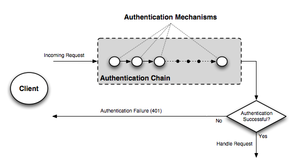
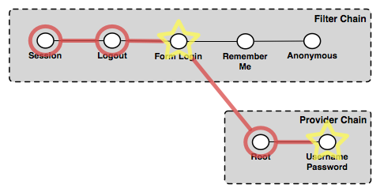
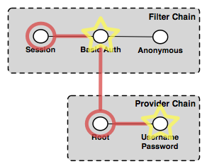

.. _sec_auth:

Authentication
==============

How authentication in GeoServer works is determined by the type of GeoServer resource being accessed. For instance
authentication for the :ref:`web_admin` is different than authentication for :ref:`OGC <services>`
and :ref:`REST <rest_overview>` services. While everything under the hood is configurable GeoServer ships with a default
security configuration that is explained in more detail below. 

Web admin
---------

The web admin application is based primarily on form-based authentication in which a user authenticates through a form in 
a web browser. Upon successful authentication a session is created on the server so that the user does not have to 
continuously login for each page they wish to access. This should be no surprise as this scheme is common and used by most
web applications that provide login capabilities. 

An optional "remember me" setting is also supported that when engaged will store authentication information in a browser
cookie. This cookie allows the user to "auto-login" for future requests after the initial browser session has timed out.
Again this is a common feature of many modern web applications.

The process of web admin authentication typically flows as follows:

#. User visits the web admin page for the first time, no session or remember me cookie is available so the user is 
   anonymously authenticated
#. User accesses a secured page and is presented with a login form
#. Upon successful login a session is created and:
 
   * If the user has sufficient privileges to access the page the user is redirected to the page accordingly
   * If the user does not have sufficient privileges to access the page the user is redirected to the home page
   
#. Upon subsequent requests the user is authenticated via browser session until the session expires or the user logs out

OGC and REST services
---------------------

OGC and REST services employ an authentication scheme in which credentials are supplied by the client on each request. This 
stems mostly from the fact that these services are stateless in nature, so a session is not created automatically as it is 
with the web admin application. However "session integration" is supported, meaning that if a session already exists on the
server it will be used for authentication. An example of this is a user logging in to the web admin tool and then accessing
an OGC or REST service in the same browser session. This scheme has the additional benefit of avoiding the overhead of 
session creation.

The default GeoServer configuration ships with support for only `HTTP Basic authentication <http://en.wikipedia.org/wiki/Basic_access_authentication>`_  for services, although alternative methods are 
available through further configuration and additional security extensions.

The process of services authentication typically flows as follows:

#. User makes a service request, not supplying any credentials
#. If the user is accessing a non-secured resource the request is handled normally
#. If the user is accessing a secured resource:

   #. An HTTP 401 error code is sent back to the client, which usually forces the client to prompt the user for credentials
   #. The service request is repeated with the appropriate credentials included, usually in the HTTP header as with Basic 
      HTTP authentication. 
   #. If the user has sufficient privileges to access the resource the request is handled normally
   #. If the user does not have sufficient privileges an HTTP 404 error code is returned to the client

#. Subsequent requests include the original user credentials

How authentication works
------------------------

To understand how GeoServer authentication works it helps to have a basic understanding of some key concepts. The first of
which is the *authentication chain*. The role of the authentication chain is to process a request and apply configured 
authentication mechanisms to it order to authenticate. Examples of authentication mechanisms include:

* Basic username/password - Performs authentication by looking up user information in an external user database
* Anonymous - Essentially performs no authentication, allows a request to proceed without any credentials
* Remember-me - Performs authentication by recognizing previously sent browser cookies
* LDAP - Authentication against an LDAP database
 
There are many, this is by no means a comprehensive list. Many authentication mechanisms may be active within GeoServer at 
a given time. To help explain further consider the following figure that depicts the flow of a generic request.

Before dispatching a request to the appropriate service or handler, GeoServer first filters the request through the 
authentication chain. The request is passed to each mechanism in the chain in order, and each is given the chance to authenticate the request. If a mechanism in the chain is able to successfully authenticate the request moves to normal 
processing. If not the request is not routed any further, and an authorization error (usually a 401) is returned to the 
user.

All that said the above description is somewhat over simplified. The authentication chain is actually made up of two chains: a *filter* chain and a *provider* chain. The filter chain is a pre-processing chain that determines if further 
authentication of a request is required. The provider chain is what that does the actual authentication of credentials. With that consider the following more detailed diagram. 

.. image:: images/auth_chain2.png
   :align: center

The filter chain does a variety of things, including:

* Gathering user credentials from a request, for example from basic and digest authentication headers
* Handling events such as logout, or the setting of the remember-me flag
* Performing session integration, detecting existing sessions and creating new sessions
* Invoke the authentication provider chain to perform actual authentication

The filter chain is actually processed twice, first before the request is handled, and then again post request. 

The provider chain is concerned solely with performing the underlying authentication of a request. It
is invoked by the filter chain in cases where a filter determines that actual authentication is required. 

The relationship is better explained with a more concrete example. The following shows the default configuration of the authentication chain for the web admin application.

.. image:: images/auth_chain_web1.png
   :align: center

In the above figure the filter chain is made up of four filters:

#. *Session* - Handles "session integration", recognizing existing sessions and creating new sessions on demand
#. *Logout* - Handles user logout
#. *Form login* - Handles form logins
#. *Remember me* - Handles "remember-me" authentication, recognizing when the flag is set on form login, creating the appropriate cookie, and recognizing the cookie on future requests
#. *Anonymous* - Handles anonymous access

The provider chain is made up of two providers:

#. *Root* - Special provider not usually used, discussed in more detail later
#. *Username/password* - Performs username/password authentication against an underlying user database

To illustrate how the elements of the various chains work, we will walk through a number of web admin app requests. 

User visits web admin for first time
^^^^^^^^^^^^^^^^^^^^^^^^^^^^^^^^^^^^

.. image:: images/auth_chain_web2.png

The first filter to execute is the *Session* filter. It checks for an existing session, find none so processing continues to the next filter in the chain. The *Logout* filter checks for the case of a user logging out, which
is not the case, so processing continues. The *Form login* filter checks for a form login, finds none and processing continues. The *Remember me* filter determines if this request can be authenticated from a previous session cookie, in this
case it can not so processing continues. The final filter to execute is the *Anonymous* filter which determines if the user
specified any credentials. In this case the user has not so the request is authenticated anonymously. Since no authentication is required in this case the provider chain is not processed. The response to the original request is the home page of the web admin app.

User logs in
^^^^^^^^^^^^

The *Session* filter finds no existing session, and processing continues. The *Logout* filter checks for a logout request, finds none, and continues on. The *Form login* filter recognizes the request as a form login and begins the authentication
process. It extracts the username and password from the request and invokes the provider chain. The *Root* provider checks
for the root account login, and not finding it continues to the next provider. The *Username/password* provider determines 
if the user credentials are valid, in this case they are so authentication succeeds and the user is redirected to the home
page, and is now logged in. During the post processing step the *Session* filter recognizes that a successful authentication has taken place and creates a new session.

User visits another page
^^^^^^^^^^^^^^^^^^^^^^^^

.. image:: images/auth_chain_web4.png

The *Session* filter executes and finds an existing session that is still valid. The session contains the authentication
details and no further chain processing is required. The response is the page requested by the user.

User returns to web app after session time out
^^^^^^^^^^^^^^^^^^^^^^^^^^^^^^^^^^^^^^^^^^^^^^

Since the user did not log in initial with the remember me setting, this is essentially the same chain of events as the user visiting the web app for the first time. The chain proceeds to the *Anonymous* filter that authenticates anonymously. 
The response is the user is redirected to the home page and is not logged in. 

User logs in again with remember me set
^^^^^^^^^^^^^^^^^^^^^^^^^^^^^^^^^^^^^^^

The chain of events is identical to the first login, except that the *Form login* filter after the successful authentication recognizes the "remember me" flag and triggers the creation of the browser cookie used to persist the 
authentication information.

User returns again to web app after session time out
^^^^^^^^^^^^^^^^^^^^^^^^^^^^^^^^^^^^^^^^^^^^^^^^^^^^^

.. image:: images/auth_chain_web5.png

The chain proceeds accordingly through the filters, starting with the *Session* filter finding no valid context. The *Logout* and *Form login* filters do nothing. The *Remember me* filter recognizes the browser cookie and is able to authenticate the request. The user is redirected to whatever page was accessed and remains logged in.

As another concrete example, consider the authentication chain for an OGC service which is significantly less complex than the web admin authentication chain:

.. image:: images/auth_chain_ogc1.png

In the above figure the filter chain consists of three filters:

#. *Session* - Handles "session integration", recognizing existing sessions but **not** creating new sessions
#. *Basic auth* - Extracts basic auth credentials from request HTTP header
#. *Anonymous* - Handles anonymous access

The provider chain consists of the same two providers as for the web admin. This illustrates an important point. While the 
filter chain differs depending on the type of request being made, the provider chain is always the same. Let us now consider some example requests. 

WMS client makes an anonymous GetCapabilities request
^^^^^^^^^^^^^^^^^^^^^^^^^^^^^^^^^^^^^^^^^^^^^^^^^^^^^

.. image:: images/auth_chain_ogc2.png

The *Session* filter looks for an existing session, and finding none processing continues. The *Basic auth* filter looks 
for the basic authorization header in the request, it finds none and processing continues. And finally the *Anonymous* filter executes and authenticates the request anonymously. The provider chain is not invoked.

Since GetCapabilies is a "discovery" operation it is typically not locked down even on a secure server. We will assume this
is the case here and that the request succeeds, returning the capabilities response to the client.

WMS client makes an anonymous GetMap request for a secured layer
^^^^^^^^^^^^^^^^^^^^^^^^^^^^^^^^^^^^^^^^^^^^^^^^^^^^^^^^^^^^^^^^

The chain executes exactly as the previous request in which the user is authenticated anonymously, and no actual authentication by the provider chain takes place. However in this case the layer being accessed is a secured resource so the handling of the GetMap request fails, and the server returns an exception, accompanied with a HTTP 401 error code. 
Depending on the client usually encountering a 401 error will case the client to present the user with a login dialog.

WMS client gathers credentials from user and re-issues request for secured layer
^^^^^^^^^^^^^^^^^^^^^^^^^^^^^^^^^^^^^^^^^^^^^^^^^^^^^^^^^^^^^^^^^^^^^^^^^^^^^^^^

The *Session* filter executes as above, doing nothing. The *Basic auth* filter finds the authorization header in the request and extracts the users credentials for it. It then invokes the provider chain where processing moves to the 
*Username/password* provider that does the actual authentication. The user credentials are good and processing of the request continues normally. The authenticated user is found to have the necessary privileges to access the layer and the 
GetMap request succeeds, returning the map response. 

Authentication providers
------------------------

.. toctree::
   :glob:
   :hidden:
   
   auth_*
   
The following authentication providers are available in GeoServer:

* :ref:`auth_userpasswd` - Default username password that authenticates against a user/group service
* :ref:`JDBC <auth_jdbc>` - Authenticates by connecting to a database through JDBC
* :ref:`LDAP <auth_ldap>` - Authenticates against an Lightweight Directory Access Protocol (LDAP) server    
