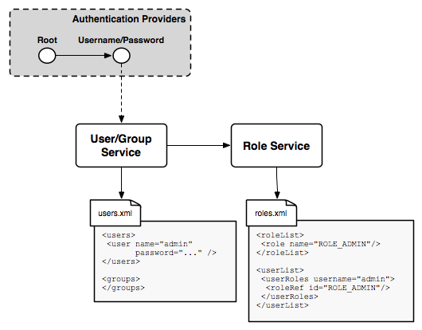

.. _sec_usergrouprole:

Users, Groups, and Roles
========================

.. toctree::
   :glob:
   :hidden:
   
   usergroup_*
   role_*

Security in GeoServer is a *role-based system* in which roles are created to serve particular functions. Examples of 
roles are accessing the WFS, administering the web admin ui, and reading a specific layer. Roles are assigned to users and
once a user has authenticated those roles determine what the user is allowed to do and not do. A role may be assigned to a
user directly, or assigned to a group of users.

.. _users_and_groups:

Users and Groups
----------------

A GeoServer user is more or less what you expect from a "user" concept in any system. For each GeoServer user the following
information is maintained:

* user name
* password, optionally stored encrypted
* set of key value pairs

A GeoServer group is simply a set of users. Information maintained for a group includes:

* group name
* list of users that are members of the group
* set of key value pairs

Key value pairs are implementation specific and may be set by the specific user/group service that the user or group 
originates from. For example, a user/group service that maintains more information about a user such as real name, email address, etc... may which to associate those data values with the user object.

User/group services
-------------------

A *user/group service* is a source of information for users and groups. It provides the following:

* listing of users
* listing of groups, and the users affiliated with each group
* user passwords

Many types of authentication providers will make use of a user/group service to perform authentication. The user/group 
is the backend database for looking up users, and performing password authentication. Depending on how the authentication
chain is configured there can be any number (including zero) user/group services active at any given time.

A user/group service can be read-only in that it only provides a source of user information, and does not allow for the 
adding of new users and groups. Such a case would be a user/group service that delegates to some external service for the
database of users and groups. An example would be an external LDAP server.

GeoServer comes with out of the box support for a single type of user/group service that persists user/group information 
as XML. Additional user/group service implementations are available as extensions. 

The following user group services are available in GeoServer:

* :ref:`usergroup_xml` - Default user/group service persisted as XML
* :ref:`usergroup_jdbc` - User/group service persisted in database via JDBC

.. _roles:

Roles
-----

A GeoServer role is a key that allows for the performing of a certain task, or accessing of a particular resource. Roles 
are assigned to users and groups in order to authorize them to perform a task. A role in GeoServer is made up of the 
following information:

* role name
* parent role
* set of key value pairs

GeoServer roles support inheritance in that one role can extend from another. The child role inherits all the access 
granted to the parent role. For example, consider a role named "ROLE_SECRET" and a role that extends from it named
"ROLE_VERY_SECRET". "ROLE_VERY_SECRET" encompasses all of what "ROLE_SECRET" can access, but not vice versa.

Key value pairs are implementation specific and may be set by the specific role service that the role originates from. For
example a role service that assigns roles based on employee organization may which to associate additional information like
department with the role.

Role services
-------------

A *role service* is a source of information of roles. It provides the following:

* listing of roles
* calculation of role assignments for a specific user

When a user/group service loads information about a user or a group, it delegates to the role service to determine which 
roles should be assigned to the user or group. Unlike user/group services there is *only* every a single active role service at any given time.

GeoServer comes with out of the box support for a single type of role service that persists role information as XML. 
Additional role service implementations are available as extensions. 

The following role services are available in GeoServer:

* :ref:`role_xml` - Default role service persisted as XML
* :ref:`role_jdbc` - Role service persisted in database via JDBC

How user/group and role services work
-------------------------------------

The following diagram illustrates user/group and role services interact in order to provide user information. 

.. image:: images/usergrouprole1.png

The user/group service provides the lookup interface for user information. Part of loading information for a user involves
delegating to the role service to determine what roles/authorities the specific user has associated with them. 

A user group service is primarily used during authentication. An authentication provider may utilize a user/group service
to perform authentication of user credentials. 

.. image:: images/usergrouprole2.png

The following figure illustrates the default user/group service, role service, and authentication provider 
configuration that GeoServer ships with.

Two authentication providers are configured. The *Root* provider authenticates for the GeoServer root account and does not
use a user/group service. The *Username/password* provider is the default one that simply passes off username and password credentials to a user/group service. 

A single user/group service that persists the user database as XML is present. The database out of the box contains a single user named ``admin`` and contains no groups. Similarly is a single role server that persists the role database as
XML. By default this contains a single role, ``ROLE_ADMINISTRATOR``, with the admin user mapped to it.

