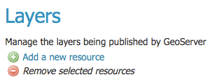
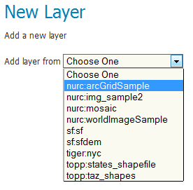
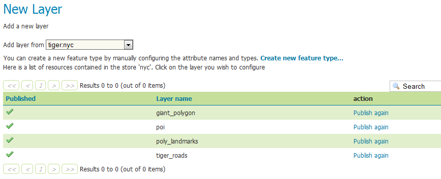
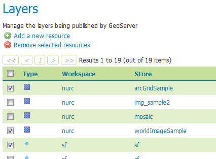
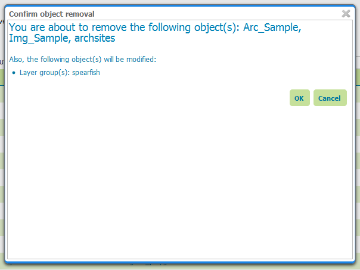

.. _webadmin_data_layers_addremove:

Adding or removing a layer
==========================

.. warning:: Document status: **Draft**

At the top of the Layers view page, there are two links for adding and removing layers.

   
   *Links to add or remove a Layer*  

Adding a layer
--------------

Clicking the :guilabel:`Add a new resource` button brings up a :guilabel:`New Layer Chooser` panel. The menu displays all currently enabled stores. From this menu, select the store from where the layer should be added. 

   *List of all currently enabled stores* 

Upon selection of a store, a table of existing layers within the selected store will be displayed, along with information on whether the layers are currently published or not.

   
   *Viewing all layers in a store* 

On selecting a layer name, you will be redirected to the :ref:`layer edit page <webadmin_data_layers_addremove>`. 

Removing a layer
----------------

To remove (unpublish) a layer, click the check box on the left side of a layer row to select that layer. Multiple layers can be selected for removal by checking multiple boxes.

.. note:: Selections for removal will not persist between results pages, so make sure to only select from one page at a time.

   
   *Layers selected for deletion*
   
All layers can be selected for removal by selecting the check box in the header row. 

Once one or more layers are selected, the :guilabel:`Remove selected resources` link will become activated. Click the link and then confirm or cancel the deletion. Selecting :guilabel:`OK` successfully deletes all selected layers.

.. note:: Some layer groups may be modified as a result of this action.

   *Confirming layer deletion*

Removing a layer does not affect the underlying store. The layer can easily be republished as long as the store remains connected.
