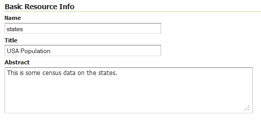

.. _webadmin_data_layer_edit:

Editing layers
==============

Clicking the name of a layer will bring up the ability to edit layer configuration. There are four tabs for each layer, each corresponding to a different area of configuration:

* :guilabel:`Data`—Layer information and data parameters
* :guilabel:`Publishing`—Settings related to layer publishing, such as styles
* :guilabel:`Dimensions`—WMS Dimensions settings, either Time or Elevation
* :guilabel:`Tile Caching`—Caching settings for the built-in tile cache

   *Layer editing tabs*

Data
----

The :guilabel:`Data` tab, activated by default, allows for defining and changing data parameters for a layer. 

The sections :guilabel:`Basic Resource Info`, :guilabel:`Keywords`, and :guilabel:`Metadata links` are analogous to the :ref:`service_metadata` sections for WCS, WFS, and WMS. These sections provide "data about the data," specifically text-based information that make the layer data easier to work with. 
   
Basic Resource Info
~~~~~~~~~~~~~~~~~~~

* :guilabel:`Name`—Identifier used to reference the layer in WMS requests
* :guilabel:`Title`—Human-readable description to briefly identify the layer to clients (required)   
* :guilabel:`Abstract`—Longer-form description of the layer

   *Basic Resource Info*

Keywords
~~~~~~~~

Keywords are a list of short words associated with the layer to assist in catalog searching.

* :guilabel:`Current Keywords`—All keywords associated with the given layer
* :guilabel:`New Keyword`—For entering in new keywords
* :guilabel:`Vocabulary`—Type of keyword

   *Keywords*

Metadata links
~~~~~~~~~~~~~~

Metadata links allow linking to external documents that describe the data layer. 

In WMS 1.1.1, only two standard format types are valid: TC211 and FGDC. TC211 refers to the metadata structure established by the `ISO Technical Committee for Geographic Information/Geomatics <http://www.isotc211.org/>`_ (ISO/TC 211) while FGDC refers to those set out by the `Federal Geographic Data Committee <http://www.fgdc.gov/>`_ (FGDC) of the United States.

In WMS 1.3.0 and later, in addition to the above format types, other formats, such as ISO191115:2003 are supported.

   *Metadata links*  

Coordinate Reference Systems
~~~~~~~~~~~~~~~~~~~~~~~~~~~~

A coordinate reference system (CRS) defines how georeferenced spatial data relates to real locations on the Earth's surface. CRSs are part of a more general model called Spatial Reference Systems (SRS), which includes referencing by coordinates and geographic identifiers. GeoServer needs to know the expected Coordinate Reference System of the data. This information is used for computing the bounding box and is used when reprojecting the data during both WMS and WFS requests.

* :guilabel:`Native SRS`—The projection the layer data is stored in. Clicking the projection link displays a description of the SRS.
* :guilabel:`Declared SRS`—Refers to the SRS that GeoServer will advertise for the layer.
* :guilabel:`SRS Handling:`—Determines how GeoServer should handle projection when the Native and Declared SRS differs. Options are :guilabel:`Force declared`, where the Declared SRS is used regardless of what the data claims to be using, :guilabel:`Reproject native to declared`, where the data is reprojected to the Declared SRS, and :guilabel:`Keep native`, which uses the Native SRS regardless of what the Declared SRS says.

   *Coordinate Reference Systems*

Bounding Boxes
~~~~~~~~~~~~~~

The bounding box determines the extent of a layer. The :guilabel:`Native Bounding Box` are the bounds of the data projected in the Native SRS. You can generate these bounds by clicking the :guilabel:`Compute from data` button. The :guilabel:`Lat/Lon Bounding Box` computes the bounds based on standard latitude/longitude values. These bounds can be generated by clicking the :guilabel:`Compute from native bounds` button.

Both bounds need to be computed before a new layer can be saved.

   *Bounding Boxes*

Feature Type Details / Coverage Parameters
~~~~~~~~~~~~~~~~~~~~~~~~~~~~~~~~~~~~~~~~~~

The next section will differ depending on whether the layer is a vector layer or raster layer.

Vector layers have a list of the :guilabel:`Feature Type Details`. This is a list of all the attributes associated with the layer, along with their type.

   *Feature Type Details*

The :guilabel:`Nillable` option refers to whether the property requires a value or may be flagged as being null. Meanwhile :guilabel:`Min/Max Occurrences` refers to how many values a field is allowed to have. In most cases, both :guilabel:`Nillable` and :guilabel:`Min/Max Occurrences` will be set to ``true`` and ``0/1``.

.. note:: Optional coverage parameters are possible for certain types of raster data. WorldImage formats request a valid range of grid coordinates in two dimensions known as a :guilabel:`ReadGridGeometry2D.` For ImageMosaic, you can use :guilabel:`InputImageThresholdValue`, :guilabel:`InputTransparentColor`, and :guilabel:`OutputTransparentColor` to control the rendering of the mosaic in terms of thresholding and transparency. 

Publishing 
----------

The publishing tab is for editing settings related to layer publishing, such as styles.

Edit layer
~~~~~~~~~~

This section determines basic publishing information about the layer.

* :guilabel:`Name`—The name of the published layer. This can only be changed on the Data tab.
* :guilabel:`Enabled`—A layer that is not enabled will not be advertised as part of the capabilities documents, and therefore will not be available for any kind of request.
* :guilabel:`Advertised`—A layer that is enabled but not advertised will still be available for requests, but will not show up as part of the capabilities documents.

   *Edit layer*

HTTP Settings
~~~~~~~~~~~~~

HTTP Settings refer to cache parameters that are applicable to the HTTP response from client requests.

* :guilabel:`Response Cache Headers`—When selected, GeoServer will not request the same tile twice within the time specified in :guilabel:`Cache Time (seconds)`.
* :guilabel:`Cache Time (seconds)`—The time to wait to request the same tile twice. The default value is one hour (3600).

   *HTTP Settings*

WFS Settings
~~~~~~~~~~~~

This section affects only WFS requests. It will only display for vector layers.

* :guilabel:`Per-Request Feature Limit`—Maxmimum number of features that can be requested in a given request. If the ``maxFeatures`` parameter is specified to be a larger value than this setting, it will be ignored. Default is 0, or unlimited.
* :guilabel:`Maximum number of decimals`—Maximum decimal places to be returned for decimal-based attribute values. Default is 0, or unlimited.

.. todo:: Guessing on this one.

   *WFS Settings*

WCS Settings
~~~~~~~~~~~~

This section affects only WCS requests. It will only display for raster layers.

.. todo:: This entire section needs checking. Also, second New Request SRS List presumably should be New Response SRS List

* :guilabel:`Current Request SRS List`—SRS List that are available to use in requests. Additional SRSs can be added or deleted.
* :guilabel:`Current Response SRS List`—SRS List that are available to use in responses. Additional SRSs can be added or deleted.
* :guilabel:`Default Interpolation Method`—Specifies the raster rendering process. Options are nearest neighbour, bilinear, or bicubic.
* :guilabel:`Native Format`—Specifies the source format of the underlying data. This option can't be changed.
* :guilabel:`Supported Formats`—Specifies the image formats available 

   *WCS Settings*

WMS Settings
~~~~~~~~~~~~

This section affects only WMS requests. It will display regardless of the layer data type.

* :guilabel:`Queryable`—Specifies whether the given layer will respond to queries
* :guilabel:`Default style`—Style that will be used when the client does not specify a named style in GetMap requests
* :guilabel:`Additional styles`—Other styles that can be associated to this layers. Some clients will present these as styling alternatives for that layer.
* :guilabel:`Default rendering buffer`—Default value of the ``buffer`` GetMap/GetFeatureInfo vendor parameter. See the :ref:`wms_vendor_parameters` for more details.
* :guilabel:`Default WMS path`—Location of the layer in the WMS capabilities layer tree. Useful for building non-opaque layer groups.

.. todo:: Guessed on Queryable.

.. todo:: Non-opaque layer groups?

   *WMS Settings*

Authority URLs for this WMS Layer
~~~~~~~~~~~~~~~~~~~~~~~~~~~~~~~~~

.. todo:: What's an Authority URL?

   *Authority URLs*

Layer Identifiers
~~~~~~~~~~~~~~~~~

.. todo:: What's a Layer Identifier?

   *Layer Identifiers*

WMS Attribution
~~~~~~~~~~~~~~~

WMS Attribution sets publishing information about data providers.

* :guilabel:`Attribution Text`—Human-readable text describing the data provider. This might be used as the text for a hyperlink to the data provider's web site.
* :guilabel:`Attribution Link`—URL to the data provider's website
* :guilabel:`Logo URL`—URL to an image that serves as a logo for the data provider
* :guilabel:`Logo Content Type, Width, and Height`—These fields provide information about the logo image that clients may use to assist with layout. GeoServer will auto-detect these values if you click the :guilabel:`Auto-detect image size and type` link.

The text, link, and URL are each advertised in the WMS Capabilities document if they are provided. Some WMS clients will display this information to advise users which providers provide a particular dataset. If you omit some of the fields, those that are provided will be published and those that are not will be omitted from the capabilities document.

   *WMS Attribution*

KML Format Settings
~~~~~~~~~~~~~~~~~~~

This section limits KML output features based on certain criteria, sometimes known as *regionation*.

* :guilabel:`Default Regionating Attribute`—Chooses which feature should show up more prominently than others
* :guilabel:`Regionating Methods`—There are four types of :guilabel:`Regionating Methods`:

  * *external-sorting*—Creates a temporary auxiliary database within GeoServer. The first request to build an index takes longer than subsequent requests. 
  * *geometry*—Externally sorts by length (if lines) or area (if polygons)
  * *native-sorting*—Uses the default sorting algorithm of where the data is hosted. It is faster than external-sorting, but will only work with PostGIS datastores.
  * *random*—Uses the existing order of the data and does not sort

* :guilabel:`Features Per Regionated Tile`—Maximum number of features in each regionated tile.

   *KML Format Settings*

Dimensions
----------

The Dimensions tab allows for configuration of the custom **WMS dimensions** that can be published with GeoServer. The available custom dimensions are Time (temporal) and Elevation (vertical).

.. todo:: Link to WMS dimensions reference page when it exists.

These options may be disabled depending on the data types of the attributes:

* For Time to be available, one of the attributes must be of type **Date**.
* For Elevation to be available, one of the attributes must be of type **Number**.

   *Dimensions tab with options disabled*

   *Dimensions tab with options enabled*

Checking either box opens up additional options:

Time
~~~~

Enabling time (temporal CS) allows for requests that can be filtered over a specific time period based on attributes in the data.

* :guilabel:`Attribute`—Attribute to use when responding to temporal requests. Must have an attribute of Date
* :guilabel:`End Attribute`—*(Optional)* Ending attribute
* :guilabel:`Presentation`—Method of publishing of temporal range. Options are :guilabel:`List`, :guilabel:`Interval and Resolution`, or :guilabel:`Continuous interval`.
* :guilabel:`Resolution`—Specifies the smallest unit of resolution for the range of temporal values. Options are any combination of seconds, minutes, hours, days, weeks, months, or years. Only available if :guilabel:`Interval and Resolution` is chosen for :guilabel:`Presentation`.

   *Time dimension settings*

.. todo:: Need more details on End Attribute.

Elevation
~~~~~~~~~

Enabling elevation (vertical CS) allows for requests that can be filtered over a specific attributes in the data deemed to be its own (z-)axis.

* :guilabel:`Attribute`—The attribute to use when responding to elevation requests. Must have an attribute of Number.
* :guilabel:`End attribute`—*(Optional)* Ending attribute
* :guilabel:`Units`—CRS to use when interpreting numerical values for elevation 
* :guilabel:`Unit symbol`—Type of unit to be assumed when interpreting numerical values for elevation, such as meters (``m``) or feet (``ft``).
* :guilabel:`Presentation`—Method of publishing of elevation range. Options are :guilabel:`List`, :guilabel:`Interval and Resolution`, or :guilabel:`Continuous interval`.
* :guilabel:`Resolution`—Specifies the smallest unit of resolution for the range of elevation values, in the units of the above value for :guilabel:`Units`. Only available if :guilabel:`Interval and Resolution` is chosen for :guilabel:`Presentation`.

   *Elevation dimension settings*

Tile Caching
------------

The Tile Caching tab affects caching settings for the built-in :ref:`tile cache <geowebcache>` for that layer. See :ref:`webadmin_tilecaching` for more information.

   *Tile Caching Settings*

