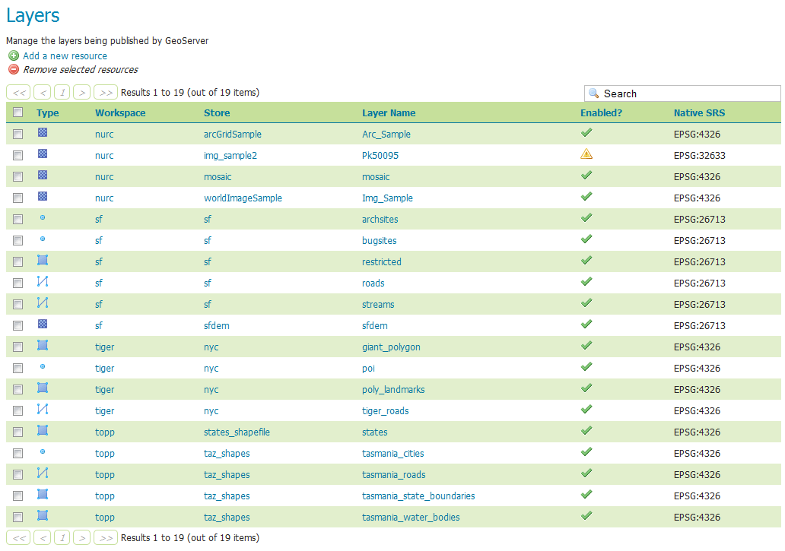

.. _webadmin_data_layers_view:

Viewing layers
==============

.. warning:: Document status: **Draft**

The initial Layers view page displays relevant dependencies for each layer, such as the layer's store and workspace. In addition, the page displays the layer's status and native SRS.

   *Layers view*
   
Layers are organized into four types of data: raster data and three types of vector data. Raster format data is a cell-based representation of features, with each cell having a distinct value. Vector types store information about feature types as mathematical paths—a point as a single coordinate, lines as a series of coordinates, and polygons as a series of coordinates that start and end at the same point and fill the enclosed area.

In the layer list, the data types are represented by icons:

.. list-table::
   :header-rows: 1

   * - Icon
     - Geometry type
   * - .. image:: ../../images/data_layers_point.png
     - Point  
   * - .. image:: ../../images/data_layers_line.png
     - Line  
   * - .. image:: ../../images/data_layers_polygon.png
     - Polygon  
   * - .. image:: ../../images/data_layers_raster.png
     - Raster

Clicking the name of a layer (under the :guilabel:`Layer Name` column) opens up a configuration panel where layer settings can be edited. 
